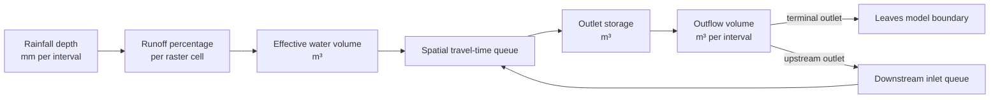

# Conceptual hydrological model (draft for review)

> Status: validated decision captured by the prototype for “Define the conceptual
> hydrological model and conservation invariants”.

## Purpose and boundary

The model converts a spatially uniform rainfall series into routed outflow volume,
discharge, and water level for coupled Hoge Beek subcatchments. It is a rapid
scenario model based on spatially distributed travel time, not a calibrated
hydrodynamic or forecasting model.

The simulation boundary contains:

- rainfall-to-effective-rainfall transformation on every valid raster cell;
- travel of effective water through a D8 network to each subcatchment outlet;
- outlet storage and release;
- transfer from an upstream outlet to an inlet of a downstream subcatchment.

Evaporation, infiltration, and interception are not dynamic stores. Their combined
effect is represented by the cell runoff percentage. Water excluded by that
percentage is outside the routed-water balance.



## Spatial inputs

Each subcatchment is a regular square-cell raster with cell width `L` metres and
cell area `A_cell = L²` square metres. A valid model cell has:

- runoff percentage `r` in percent;
- D8 slope `s`;
- Manning roughness `n`;
- terrain elevation `z` in metres TAW;
- D8 flow direction and accumulated upstream area.

A cell is a channel cell when its accumulated upstream area is at least the
scenario's channel threshold. Every outlet and downstream inlet must lie on a
valid connected D8 path; every inlet must lie on a channel cell.

Measures may change terrain elevation, runoff percentage, slope, or roughness
before the simulation. Once preprocessed, a measure has no separate dynamic state.

## Timestep semantics

Rainfall timestamp `t[k]` labels the **start** of interval
`[t[k], t[k] + Δt)`. `P[k]` is the rainfall depth accumulated over that complete
interval. The model processes every interval exactly once, including `k = 0`.

For each interval, the state transition is:

```text
given all states at interval start
  1. consume P[k]
  2. visit subcatchments in topological upstream-to-downstream order
  3. generate effective cell volumes for the current subcatchment
  4. receive current-interval outflow from its upstream subcatchments
  5. enqueue local and inlet volumes by spatial travel-time lag
  6. release volumes whose lag expires into outlet storage
  7. route outlet storage and determine O[k]
  8. record O[k] for the interval and water level H[k+1] at interval end
```

An output interval should therefore carry both `interval_start` and
`interval_end`, or use `interval_end` as the timestamp while documenting that
outflow is the volume over the preceding interval. A water level is an
instantaneous end-of-interval state; it must not be presented as an interval
average.

The rainfall input may cover at most three days. After the last wet input
interval, zero-rainfall drain intervals continue until routed and stored water is
negligible or a documented safety limit is reached. Any residual at that limit is
reported, not discarded.

### First rainfall interval recommendation

Process rainfall record zero. The current `range(1, n_steps)` behavior loses a
valid interval and has no scientific basis in the rainfall contract. If a leading
zero is wanted for chart presentation, add it explicitly as a zero-depth spin-up
interval; never reinterpret or discard the first supplied depth.

## Rainfall transformation

Rainfall intensity is converted to interval depth before simulation. The engine
only receives rainfall depth in millimetres per model interval.

For cell `i` in interval `k`:

```text
effective_depth[i,k] = P[k] × r[i] / 100                 [mm]
generated_volume[i,k] = effective_depth[i,k] × 0.001 × A_cell [m³]
```

Required domain constraints are `0 ≤ r ≤ 100`, `P ≥ 0`, `s > 0`, `n > 0`, and
`Δt > 0`. Nodata cells generate no water and hold no state.

## Spatial travel time

The existing empirical hillslope travel-time equation and Manning-like channel
equation remain the hydrological rules unless calibration justifies replacing
them. Their parameters and unit conventions must be frozen in regression tests.

For a wet non-channel cell, the current local travel time is:

```text
τ_hill = L^0.6 n^0.6 / (effective_depth^0.4 s^0.3)       [seconds by model convention]
```

Channel travel time uses channel flow rate `q`, channel width `B = L/2`, and:

```text
τ_channel = L / ((sqrt(s)/n) × (q/B)^(2/3))^(3/5)       [seconds]
```

Local times are accumulated along the D8 path to the outlet. Generated cell
volume and received inlet volume are assigned once to half-open lag bins
`[jΔt, (j+1)Δt)`. A volume exactly on the final boundary must be included; no
volume may disappear because a bin's upper bound equals the maximum travel time.

The travel-time queue is real model state. A pulse in lag `j` is released after
`j` interval advances. Recomputing travel times for new rainfall does not move or
delete water already queued under an earlier interval's response.

## Coupled subcatchments

If subcatchment `u` feeds an inlet of subcatchment `d`, `O[u,k]` is inlet volume
for `d` in the same interval `k`:

- the shared outlet/inlet boundary has no implicit storage or travel time;
- subcatchments are evaluated in a deterministic topological order, independent
  of their input row order;
- the downstream spatial route remains responsible for travel from inlet to
  downstream outlet.

Using `O[u,k]` only in interval `k+1` would insert an artificial delay of exactly
`Δt`. If a physical connection needs additional storage or travel time, model
that state explicitly rather than hiding it in the coupling schedule. Treat each
interval volume as the average boundary forcing over that interval; use smaller
internal timesteps if this approximation is too coarse.

Multiple upstream outlets entering the same inlet cell are summed. The
subcatchment graph must be acyclic, all referenced source IDs must exist, and
each upstream outlet must have at most one downstream target unless an explicit
flow-split rule is added.

## Outlet storage and release

Each subcatchment has one outlet store with start volume `S[k]`, received volume
`I[k]`, outflow volume `O[k]`, and end volume:

```text
S[k+1] = S[k] + I[k] - O[k]
```

### Q-controlled outlet

For recession coefficient `a = 1/K` and constant interval inflow, the exact
uncapped linear-reservoir end storage is:

```text
S* = S[k] exp(-aΔt) + I[k] (1 - exp(-aΔt)) / (aΔt)
O* = S[k] + I[k] - S*
O[k] = min(O*, Qmax Δt)
S[k+1] = S[k] + I[k] - O[k]
```

`Qmax` is a rate in cubic metres per second. Capping integrated interval outflow
rather than multiplying an end-of-interval rate by `Δt` makes the transition
timestep-explicit and mass-conserving.

### H-controlled outlet

Let `Smax = V(Hmax)` from the monotone terrain-derived level-volume relation:

```text
O[k] = max(0, S[k] + I[k] - Smax)
S[k+1] = min(S[k] + I[k], Smax)
```

The level-volume curve must cover every reachable storage and `Hmax`; inverse
lookup must not silently clamp a larger storage to the raster's maximum terrain
elevation. Water level is `H[k+1] = V⁻¹(S[k+1])` in metres TAW.

## Conservation boundaries and invariants

For a subcatchment over one interval:

```text
generated local volume + received upstream volume + initial transit + initial storage
= emitted upstream/terminal outflow + final transit + final storage
```

For the whole coupled system from start through interval `N`:

```text
Σ generated effective volume
= Σ terminal outflow + Σ final outlet storage + Σ final travel queues
```

The shared subcatchment boundary holds no water, so there is no separate
inter-subcatchment transfer queue in the balance:

```text
upstream outflow volume in interval k = downstream inlet volume in interval k
```

Upstream outflow transferred internally is not also counted as terminal outflow.
The following invariants are mandatory:

1. Every rainfall interval is consumed once; every generated water parcel is put
   in exactly one lag bin.
2. All routed volumes, queue contents, and storages are finite and non-negative.
3. `0 ≤ O[k] ≤ S[k] + I[k]`; Q-controlled outflow also satisfies
   `O[k] ≤ Qmax Δt`.
4. Per-interval and whole-event balance residuals are within an agreed floating
   point tolerance scaled to total effective volume.
5. Results do not depend on the input row order of subcatchments.
6. Splitting or merging rainfall source records without changing normalized
   interval depths does not change engine inputs.
7. A dry, empty system remains dry and empty.

Rainfall excluded by runoff percentages may be reported as an input diagnostic,
but it is not a loss from the routed-water balance because it never crosses that
balance boundary.

## Outputs and units

| Output | Semantics | Unit |
| --- | --- | --- |
| Rainfall depth | Accumulated over one model interval | mm/interval |
| Outflow volume | Volume crossing an outlet during one interval | m³/interval |
| Discharge | `outflow volume / Δt` | m³/s |
| Water level | Outlet-store level at interval end | m TAW |
| Water depth | `max(water level - terrain, 0)` | m |
| Hydrograph | Time series of terminal-outlet discharge | m³/s |
| Time to peak | End-time difference from start of first wet interval | minutes |
| Balance residual | Input minus output and retained states | m³ |

Only terminal-outlet hydrographs contribute to whole-system external outflow.
Subcatchment outflows remain available as diagnostic series for coupled-flow
inspection.

## Worked edge cases

### Rain in the first record

With `[10, 0]` mm and a 50% runoff cell of 100 m², interval zero generates
`10 × 0.5 × 0.001 × 100 = 0.5 m³`. It must enter a travel bin. The current loop
generates zero and violates the event balance by 0.5 m³.

### Travel time exactly one timestep

For `τ = Δt`, the volume belongs to lag 1, not to no bin and not to lag 0. Half-open
bins need an inclusive final edge or direct integer lag calculation.

### Two upstream outlets share an inlet cell

If their prior-interval outflows are 2 m³ and 3 m³, the inlet receives 5 m³. An
array assignment that overwrites one with the other violates conservation.

### Rain stops before water arrives

A pulse in a two-interval travel bin remains in transit through dry intervals and
eventually reaches the outlet. Dry weather prevents new local generation; it does
not erase earlier routed water.

### Capped Q outlet

With 8 m³ available and `Qmax Δt = 3 m³`, outflow is at most 3 m³ and at least
5 m³ remains stored. No choice of `K` may make storage negative.

## Present behavior: rule or artifact?

| Present behavior | Classification |
| --- | --- |
| Rainfall is normalized to depth per model interval | Essential rule |
| Cell runoff percentage transforms rainfall to effective depth | Essential rule |
| D8 distributed travel time with separate hillslope/channel velocities | Essential rule |
| Outlet Q- and H-controlled stores | Essential rule |
| Upstream outlet volume enters downstream one interval later | Accidental scheduling artifact; couple in the same interval |
| First rainfall record is skipped | Accidental artifact; remove |
| `tv_convolve_next` sums the newest response column instead of advancing lag diagonals | Accidental artifact; spatial delay is currently ineffective |
| Lag bins can exclude the cell at the maximum travel time | Accidental artifact; loses volume |
| Two inlet volumes at one cell overwrite rather than sum | Accidental artifact; loses volume |
| Simulation stops with no drain tail or residual-state report | Accidental truncation |
| Q-store outflow is end-rate multiplied by interval duration | Numerical artifact; replace with integrated mass-conserving transition |
| Level-volume interpolation silently clamps beyond its sampled range | Numerical artifact; reject or extend the curve |
| Maximum 200 travel bins are spread over the full travel-time range | Performance approximation; retain only behind an explicit accuracy tolerance |

## Accepted decisions

The model contract adopts these four connected choices:

1. timestamps label interval starts and every supplied interval, including the
   first, is processed;
2. upstream outflow is downstream inlet volume in the same interval, evaluated
   in topological upstream-to-downstream order;
3. dry drain intervals extend beyond the rainfall input, with residual water
   reported at a safety limit;
4. Q-controlled storage uses integrated, capacity-limited outflow rather than the
   legacy end-rate approximation.
